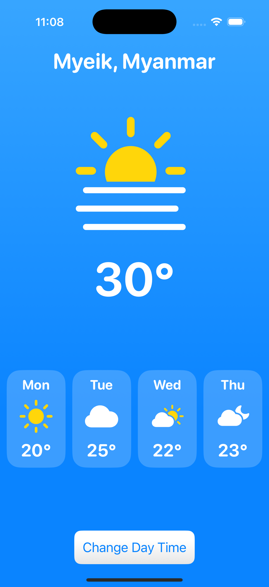
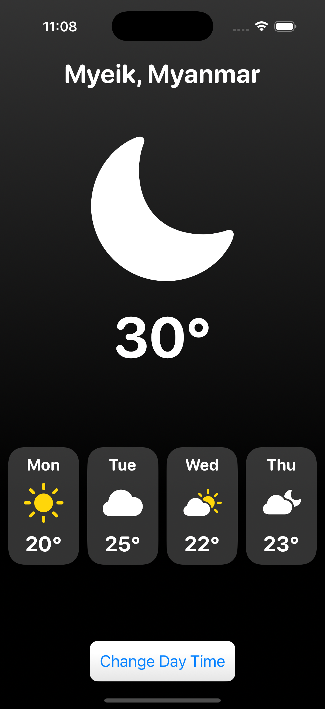

# Weather UI

A simple weather app UI built with SwiftUI.

## Features

- Displays weekday, weather icon, and temperature
- Clean and modern SwiftUI layout

## Preview

  
  

## Getting Started

### Prerequisites

- Xcode 12 or later
- macOS

### Running the App

1. Clone this repository or copy the project files.
2. Open `weather-ui.xcodeproj` in Xcode.
3. Build and run the app using the simulator or a real device.

## Project Structure

- `ContentView.swift`: Main UI components
- `MyApp.swift`: App entry point
- `Assets.xcassets`: App icons and color assets

## Customization

- Update weather icons and colors in `Assets.xcassets`.
- Modify UI in `ContentView.swift` as needed.

## License

This project is for learning and demonstration purposes.
